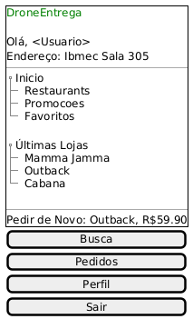
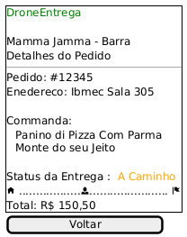

## Introdução

 A construção de um protótipo de baixa fidelidade é uma etapa essencial nas fases iniciais de desenvolvimento de um sistema, pois permite visualizar de forma simples e rápida como será a interface do usuário, antes mesmo de se preocupar com aspectos visuais e de programação. No nosso caso, o protótipo busca representar um aplicativo de entrega de comida utilizando drones, com foco na entrega em locais de difícil acesso, como ilhas. 

## Metodologia

 Para a elaboração do protótipo de baixa fidelidade, a equipe iniciou com um brainstorming sobre as funcionalidades essenciais do aplicativo. Com base nisso, foram definidos os fluxos principais e as telas iniciais a serem representadas. A criação dos esboços foi feita à mão (ou utilizando ferramentas básicas de desenho), priorizando a simplicidade, clareza dos elementos e funcionalidade. As três telas principais desenvolvidas foram: tela de login, tela de pedido em andamento e tela de pedido finalizado. 

## Protótipo de baixa fidelidade

## Tela de Login
Representa o primeiro acesso do usuário ao aplicativo, onde ele deve inserir seu login e senha.

## Tela Inicial
Mostra opções como restaurantes, promoções, favoritos e as últimas lojas que o cliente efetuou um pedido.

## Tela de Pedido em Andamento
Exibe o status do pedido, número do pedido, endereço de entrega, nome do restaurante e itens comprados.

## Conclusão

 A elaboração do protótipo de baixa fidelidade permitiu entender melhor o fluxo principal de interação do usuário com o aplicativo de entregas por drone. A visualização prévia dessas funcionalidades ajudará na organização do desenvolvimento, facilitando futuras decisões de design e implementação. 

 Essas três telas foram escolhidas para representar o fluxo essencial de uso do aplicativo: desde o login, passando pela tela inicial , até a o acompanhamento da entrega. Como se trata de um protótipo de baixa fidelidade, o foco está na disposição dos elementos e na experiência básica do usuário, não nas cores ou no design visual. 

## Referências
> Mapa Mental feito usando PlantText UML,  Disponível em: [PlantText UML](https://www.planttext.com/)

 
## Versionamento
| Data | Versão | Descrição | Autor(es) |
| -- | -- | -- | -- |
| 08/04/2025 | 1.0 | Editando do documento | Gabriel Maia |
| 08/04/2025 | 2.0 | Adicionado image baixa fidelidade | Gabriel Maia |
| 08/04/2025 | 2.1 | Editou imagems baixa fidelidade | Nicholas Borges |

